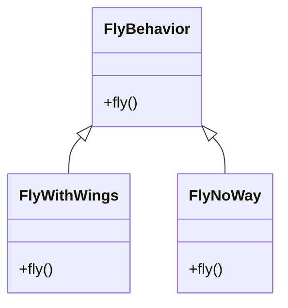

#### 오리 시뮬레이션 게임

duck 클래스를 상속하는 모든 하위 클래스에게 fly()라는 기능을 추가한느 경우 fly()가 있어서는 안 되는 하위 클래스까지 상속이 되어 오류가 날 수 있다

```java
public class Duck {  
   public void quack();  
   public void fly(); 
   // 기존 코드 
   public void eat();
   public void walk();
}
```
> 코드를 재사용하는 것은 좋지만 유지보수를 생각하면 좋지 않음
> 고무오리가 날 수도 있고 고무 오리가 꽥 소리를 낼 수도 있는 존재해서 안 되는 걸 만들어 버리니까!


duck을 상속하는 서브 클래스가 몇 개 없다면 그냥 각각 서브클래스 가서 따로 하나씩 메서드를 오버라이드 해주면 동작은 한다
다만 이건 **유지보수가 매우 힘들다**

---

#### 인터페이스 설계 하기
- 무작정 상속만 한다고 올바른 것은 아니다. 위에 상황이면 계속 서브 클래스마다 **오버라이드** 해주고 귀찮은 일 투성이
- fly()라는 특정 기능을 duck클래스가 아닌 따로 인터페이스를 구현해서 특정 오리들에게만 구현하도록 설계
  ➡️ 다만 **코드 중복** 이 생긴다 . 기존에 있던 코드들 전부 수정해야하기에 매우 귀찮음!!

> 소프트웨어를 고칠 때 **기존 코드에 미치는 영향을 최소화** 하면서 작업하도록 하는 것이 중요하다


---

#### 문제를 명확하게 파악하기

- 상속은 여기서 좋지 않음 -> 서브 클래스마다 오리 행동이 다를 수 있는데 모든 서브 클래스에게 한 가지 행동만 시키니까
- fly() 등 특정 기능을 인터페이스화 하는 것은 좋아보이지만 인터페이스에는 구현된 코드가 없다보니 **구현체들이 전부 해당 메서드를 추가**해야하는 단점이 있음
- 즉 한가지 행동 바꾸면 또 그 밑에 것도 다 바뀌도록 고쳐야하니까 버그 생길 수도 있다

> 디자인 원칙이란 ?
> 애플리케이션에서 달라지는 부분을 찾아서 나머지 코드에 영향을 주지 않도록 **캡슐화**하여 나머지 코드와 분리하고 , 분리함으로서 에러를 줄이고 시스템의 유연성을 향상시킬 수 있다.


---

#### 바뀌는 부분과 그렇지 않은 부분 분리하기

변화하는 부분과 나머지를 분리하려면 2개의 클래스 집합으로 나누어야한다
- fly()
- quack()

해당 2가지가 기존 duck클래스와 다른 추가된 메서드들

---

#### 오리의 행동 디자인 하기

> 구현 보다는 인터페이스에 맞춰서 프로그래밍 한다

duck의 행동을 인터페이스로 나누고 해당 행동을 따로 별도 클래스에서 구현시킴
duck클래스에서는 해당 행동을 구현시킬 필요없이 미리 만들어둔 별도 클래스 상속하면 기존 코드 안 건드리고 기능 사용가능

> 인터페이스에 맞춰서 프로그래밍 한다 = 상위 형식에 맞춰서 프로그래밍한다
> 상위 형식 = 변수 선언시 **추상 클래스** 혹은 **인터페이스** 같이 상위 형식으로 선언
> 다형성의 활용
> ex) Animal a = new Dog();

FlyBehavior와 QuackBehavior 2개 인터페이스 사용하고
그 밑에 해당 행동을 구현 시킨 클래스들을 배치



![[Pasted image 20230710223554.png]]

해당 형식으로 별도 기능들을 분리해서 인터페이스로 따로 **캡슐화**를 한 다음 해당 행동을 구현시킨 별도의 클래스를 만들게 되면 **기존 행동 클래스를 수정하지 않고도 상속을 통해서 행동을 추가**할 수 있다

---

#### 오리 행동 통합하기

나는 행동 꽥꽥 거리는 행동을 DUCK클래스에서 정의하는 것이 아니라 다른 클래스에 **위임**하는 것이 중요!

기존에 Duck클래스에 있던 코드를 수정


```java
public class Duck {  
   // 다형성 위해서 
   public FlyBehavior flyBehavior
   public QuackBehavior quackBehavior
    
   // 기존 코드 -> 원래 있던 fly() , qauack()삭제
   public void eat();
   public void walk();
}
```

```java
public abstract class Duck{
	// 모든 duck에는 quakcBehavior 인터페이스 구현해야함
	QuackBehavior quackBehavior;

	// 괙 소리르 직접 처리하는 대신 quackBehavior로 참조되는 객체에게 그 행동을 위임! 즉 꽥꽥 할 때는 객체 종류 상관없이 quack()실행하면 오케

	public void performQuack(){
		quackBehavior.quack();
	}
}
```

```java
public class MallardDuck extends Duck{

	public MallardDuck(){
	// Duck을 상속할 때 얻은 다형성이 있는 상속받은 인스턴스 변수들을 생성자에서 초기화
	// 초기화 할 때 이미 해당 행동들이 구현되어 있는 별도 클래스 중에서 사용할 것들을 보고 바꿔 끼우기만하면 별도 노력없이 코드 재사용이 가능 = 위임  
		quackBehavior = new Quack();
		flyBehavior = new FlyWithWings();
	}
}
```

---

#### 오리코드 테스트

```java
public abstract class Duck {  
   FlyBehavior flyBehavior;  
   QuackBehavior quackBehavior;  
  
   public Duck() {  
   }  
  
   public void setFlyBehavior(FlyBehavior fb) {  
      flyBehavior = fb;  
   }  
  
   public void setQuackBehavior(QuackBehavior qb) {  
      quackBehavior = qb;  
   }  
  
   abstract void display();  
  
   public void performFly() {  
      flyBehavior.fly();  
   }  
  
   public void performQuack() {  
      quackBehavior.quack();  
   }  
  
   public void swim() {  
      System.out.println("All ducks float, even decoys!");  
   }  
}
```

```java
public class MiniDuckSimulator {  
   
public static void main(String[] args) {  
  
	Duck mallard = new MallardDuck();  
	// MallardDuck은 Duck클래스에서 상속받은 메서드가 있고 해당 메서드를 구현한 별도 클래스를 변수로서 가지고 있음 해당 변수가 참조하고 있는 클래스에게 해당 역할을 위임해서 실행됨 
	mallard.performQuack();

}
```


----

#### 동적으로 행동 지정하기
- duck클래스에 해당 함수 추가해서 추후에 별도 역할이 구현된 별도 클래스를 바꿔 끼울 때 사용하여 날지못하는 오리를 날 수 있도록 변경하는 것도 가능
```java
public void setFlyBehavior(FlyBehavior fb) {  
   flyBehavior = fb;  
}  
  
public void setQuackBehavior(QuackBehavior qb) {  
   quackBehavior = qb;  
}
```


---


#### 캡슐화된 행동 살펴보기

![[Pasted image 20230710230304.png]]
Duck에서 보면 클래스 2개를 변수를 써서 직접 상속받지 않고 2개 인스턴스 변수로 받아서 사용을 하는데 저런 식으로 사용하는 것이 구성

#### 두 클래스 합치는 방법
> A에는 B가 있다 : 오리 클래스는 나는 기능 , 우는 기능이 있다  또한 각 행동을 위임해서 사용한다
>
> 두  클래스를 합치는 것을 **구성**
> ➡️**상속보다는 구성을 활용하자**


---

> ==전략 패턴==
> 알고리즘을 정의하고 캡슐화하여 각 알고리즘군을 수정하여 쓸 수 있게 해줌
> 전략 패턴을 사용하면 클라이언트로부터 알고리즘을 분리 독립적으로 변경 가능


---- 

### 마무리

1. 객체지향 기초
- 추상화
- 캡슐화
- 다형성
- 상속

2. 객체지향 원칙
- 바뀌는 부분은 캡슐화
- 상속보다는 구성을 활용
- 구현보다는 인터페이스 즉 상위 영역에 맞춰 프로그래밍

3. 객체지향 패턴
   **전략패턴** : 알고리즘군 정의하고 캡슐화하여 각각 알고리즘군을 수정해 쓸수 있도록 설계 클라이언트로부터 알고리즘을 분리해서 독립적으로 변경 가능 


