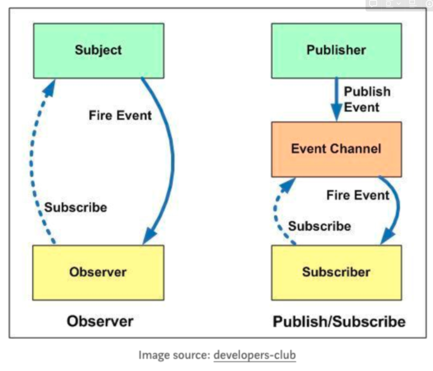

# 옵저버 패턴

## 옵저버 패턴이란?

한 객체의 상태가 바뀌면 그 객체에 의존하는 다른 객체에게 연락이 가는 일대다 의존성을 정의하는 방식

---

## 옵저버 패턴의 구성요소 - Subject

### Subject 객체
Subject가 알고 있는 것(멤버 변수, 프로퍼티)  
→ Observer들이 관심있어하는 타깃 인 상태값을 가지고 있음  
→ Observer들을 저장 할 컨테이너를 가지고 있음  
  
Subject 하는 일(멤버 함수, 메소드)  
→ Observer를 컨테이너에 추가  
→ Observer를 컨테이너에 삭제  
→ 상태값이 바뀌었을때 컨테이너를 순회하며 등록된 옵저버들에게 알리기  
→ 상태값에 대한 getter와 setter가 있을 수 있다.  

---
## 옵저버 패턴의 구성요소 - Observer

### Observer 객체
Observer가 알고 있는 것(멤버 변수, 프로퍼티)  
→ 없다.  
Observer 하는 일(멤버 함수, 메소드)  
→ 알림을 받았을때 수행 할 일이 정해져있다.

---
# 책에 나온 예시 분석
옵저버 패턴이 필요한 경우
```java
public class WeatherData {

    public void measurementsChanged() {
		    float temp = getTemperature(); //온도 가져오기
		    float humidity = getHumidity(); //습도 가져오기
		    float pressure = getPressure(); //기압 가져오기
		
		    //디스플레이 갱신
		    currentConditionsDisplay.update(temp, humidity, pressure);
		    statisticsDisplay.update(temp, humidity, pressure);
		    forecastDisplay.update(temp, humidity, pressure);
		    // <------ 만약 새로운 종류의 Display가 추가되면 여기도 또 추가 해야함. 😓
    }
}
```

---

# 옵저버 패턴을 적용해보자

---

# 옵저버 패턴 적용 - 인터페이스 정의
```java
public interface Subject {
    public void registerObserver(Observer o);
    public void removeObserver(Observer o);
    public void notifyObservers();
}

public interface Observer {
    void update(float temperature, float humidity, float pressure);
}

public interface DisplayElement {
    public void display();
}
```

---

# 옵저버 패턴 적용 - Subject 구현
```java
package ObserverPattern;

import java.util.ArrayList;
import java.util.List;

public class WeatherData implements Subject {

    private float temperature; // Subject가 알고 있는 것 1 : 타깃이 되는 상태값 들
    private float humidity;
    private float pressure;
    private List<Observer> observers; // Subject가 알고 있는 것 2 : 옵저버 담을 컨테이너


    public WeatherData() {
        observers = new ArrayList<Observer>();
    }

    @Override // Subject가 하는 일 1 : 옵저버를 컨테이너에 등록
    public void registerObserver(Observer o) {
        observers.add(o);
    }

    @Override // Subject가 하는 일 2 : 옵저버를 컨테이너에서 뺌
    public void removeObserver(Observer o) {
        observers.remove(o);
    }

    @Override
    public void notifyObservers() { // Subject가 하는 일 3 : 컨테이너를 순회 하며 옵저버에게 알리기
        for(Observer observer: observers) {
            observer.update(temperature, humidity, pressure); // 상태값들을 Object에게 push 해준다
        }

    }

    public void measurementsChanged() {
        notifyObservers();
    }


        // 그 외 상태값을 다루기위한 getter setter

    public void setWeatherData(float temperature, float humidity, float pressure) {
        this.temperature = temperature;
        this.humidity = humidity;
        this.pressure = pressure;

        measurementsChanged();
    }

    public float getTemperature() {
        return this.temperature;
    }

    public float getHumidity() {
        return this.humidity;
    }

    public float getPressure() {
        return this.pressure;
    }
}
```

---

# 옵저버 패턴 적용 - Object 구현
```java
package ObserverPattern.display;

import ObserverPattern.DisplayElement;
import ObserverPattern.Observer;

public class CurrentConditionsDisplay implements Observer, DisplayElement {

    private float temperature;
    private float humidity;

    @Override
    public void update(float temperature, float humidity, float pressure) {  // Subject로 부터 push 받은 데이터 가지고 각자의 일 수행
        this.temperature = temperature;
        this.humidity = humidity;

        display();
    }

    @Override
    public void display() {
        System.out.println("현재 상태:  온도 "+temperature+"F, 습도 "+humidity+"%");
    }
}
```

---
# 실행 부분

```java
public static void main(String[] args) {
    WeatherData weatherData = new WeatherData(); // Subject 인스턴트 생성

    Observer currentConditionsDisplay = new CurrentConditionsDisplay(); // Observer 인스턴트 생성
    Observer statisticsDisplay = new StatisticsDisplay(); // Observer 인스턴트 생성


    weatherData.registerObserver(currentConditionsDisplay); // Observer를 Subject에 등록
    weatherData.setWeatherData(3, 5, 7);

    System.out.println("통계 디스플레이를 추가합니다.");
    weatherData.registerObserver(statisticsDisplay); // Observer 를 Subject에 등록
    System.out.println("기상 데이터가 업데이트 됩니다.");
    weatherData.setWeatherData(20, 30, 80);

    System.out.println("현재 상태 디스플레이를 제거합니다.");
    weatherData.removeObserver(currentConditionsDisplay); // Observer 를 Subject에서 제거
    weatherData.setWeatherData(25, 30, 80);

}
```

---

# 옵저버 데이터 방식의 푸시(push) vs 풀(pull)

지금 만들어 놓은 WeatherData 디자인은 하나의 데이터만 갱신해도 되는 상황에서도 update 메소드에 모든 데이터를 보내도록 되어 있습니다. 

만약 풍속 같은 새로운 데이터가 추가되면 대부분의 update 메소드에서 새로 추가된 그 풍속 데이터를 쓰지 않더라도 모든 update 메소드를 바꿔야 한다. 대체로 옵저버가 필요한 데이터만 골라오도록 하는 pull 방법이 더 나은 방법일 수 있습니다.

---

# pull 방식으로 바꿔보기
```java
// Observer.java
public interface Observer {
    void update(); // (1) Observer에서는 이제 알림 받을때 인수 안 받음
}


// WeatherData.java
@Override
public void notifyObservers() {
    for(Observer observer: observers) {
        observer.update(); // (2) Observer가 인수 받았던 부분 삭제
    }

}
```

```java
package ObserverPattern.display;

import ObserverPattern.DisplayElement;
import ObserverPattern.Observer;
import ObserverPattern.WeatherData;

public class CurrentConditionsDisplay implements Observer, DisplayElement {

    private float temperature;
    private float humidity;
    private WeatherData weatherData; // (3) 옵저버도 이제 서브젝트를 알고 있음! -> 서브젝트도 옵저버를 알고, 옵저버도 서브젝트를 아는 상황이 되었음.

    public CurrentConditionsDisplay(WeatherData weatherData) {
        this.weatherData = weatherData;
    }

    @Override
    public void update() {
        this.temperature = weatherData.getTemperature(); // (4) update가 호출 될 때 옵저버가 알고있는 서브젝트에서 직접 꺼내온다.
        this.humidity = weatherData.getHumidity();

        display();
    }

    @Override
    public void display() {
        System.out.println("현재 상태:  온도 "+temperature+"F, 습도 "+humidity+"%");
    }
}
```

## 옵저버도 이제 서브젝트를 알고 있음! 
→ 서브젝트도 옵저버를 알고, 옵저버도 서브젝트를 아는 상황이 되었다.  
→ 🤔 순환참조가 일어나는 상황인데 과연 이 방식이 좋은 방식일까?

---

# 옵저버 패턴의 특징을 정리 해보면…

## 1. 일 대 다 관계
하나의 Subject가 여러개의 Object를 알고 있다.

## 2. 느슨한 결합
Observer 패턴에서 Subject는 Object들을 has 관계로 가지고 있고, 상태 값이 바뀌었을 때 컨테이너를 순회하며 등록 된 Observer가 제공한 update 함수만 호출 하면 되기 때문에 느슨한 결합

## 3. 출판-구독 패턴(Pub-Sub 패턴)이랑 비슷하지만 다름
Observer패턴은 Observer와 Subject가 서로를 인지하지만,  
Pub-Sub패턴의 경우 Observer와 Subject가 서로를 전혀 몰라도 상관없습니다.

*그 중간에 이벤트 별 채널로 Message Que를 활용


--- 

# Push-Pull 방식과 Pub-Sub 방식

- Push-Pull 방식  
=> 책에 나온 예시와 같이 loop 순회 하며 object의 update 함수 호출
=> loop 순회 필요

- Pub-Sub  
=> 이벤트 발행 구독의 형태
=> rxjs 예시