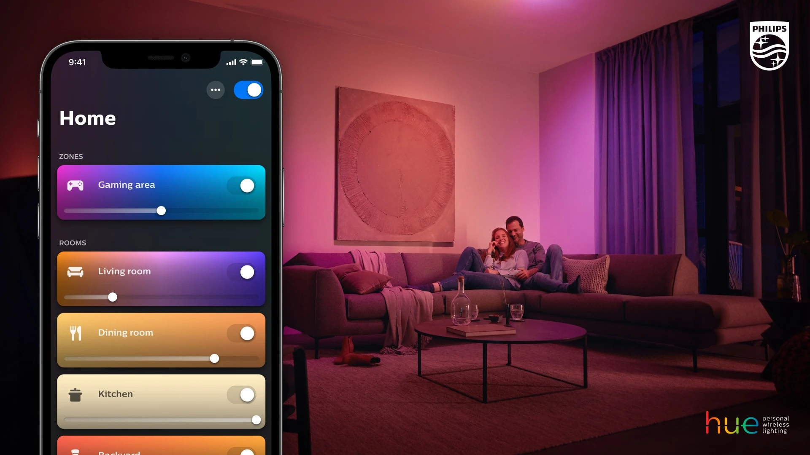

# ch06. 커맨드 패턴

> Encapsulation of Request

순차적으로 실행해야하는 여러개의 작업이 있다면 어떻게 해야 할까?

---

## Introduction : 스마트홈(Smart Home)에 대해 생각해보자.

- 리모컨을 통해 집 안의 여러가지 가전을 컨트롤한다.
    - 특정한 버튼은 특정한 기능을 수행한다.
    - 다양한 브랜드의 가전을 한꺼번에 컨트롤 하고 싶다면?

> 동일한 인터페이스를 가지고, Invoker가 Receiver를 통해 가전을 컨트롤할 수 있어야 한다.
---

---

## Command UML 

