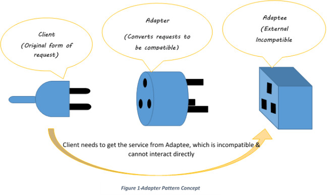
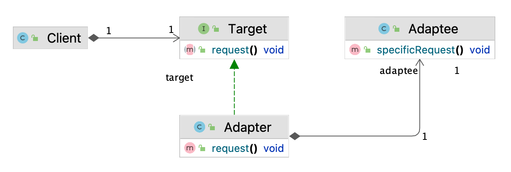

# 어댑터 패턴

## **어댑터 패턴**은   

클래스의 인터페이스를 사용자가 기대하는 다른 인터페이스로 변환하는 패턴으로, 호환성이 없는 인터페이스 때문에 함께 동작할 수 없는 클래스들이 함께 작동하도록 해준다.

> `클라이언트가 원하는 인터페이스를 덧붙여 제공하기`
---



--- 

## 주요 구성 요소
- **Client**: 어댑터를 사용하여 요청을 수행하는 객체
- **Target**: 클라이언트가 사용하려는 인터페이스
- **Adapter**: Adaptee의 인터페이스를 Target 인터페이스로 변환하는 객체
- **Adaptee**: 어댑터에 의해 감싸진 객체. 어댑터는 Adaptee의 기능을 Target 인터페이스에 맞게 변환한다.

---
## 주요 구성 요소



---

## 어댑터 패턴의 핵심: Composition
- 어댑터는 Adaptee를 새로 바뀐 인터페이스로 감쌀 때 composition(구성)을 활용한다.
- 이를 통해 어댑터는 Adaptee의 메소드를 호출하고 그 결과를 Target 인터페이스에 맞게 변환하여 반환한다.

```java
public class Adapter implements Target {
    private Adaptee adaptee;

    public Adapter(Adaptee adaptee) {
        this.adaptee = adaptee;
    }

    public void request() {
        adaptee.specificRequest();
    }
}
```
---

## 객체 어댑터 vs 클래스 어댑터

- **객체 어댑터**: Adaptee를 내부에 감싸서(Target 인터페이스에 맞게) Adaptee의 행동을 변환하는 방식. 이 방식은 Composition(구성)을 사용하며, Java와 같은 단일 상속을 지원하는 언어에서 주로 사용된다.(위의 클래스다이어그램 방식)

- **클래스 어댑터**: Adaptee를 상속받아서(Target 인터페이스에 맞게) Adaptee의 행동을 변환하는 방식. 이 방식은 Inheritance(상속)을 사용하며, **C++와 같은 다중 상속**을 지원하는 언어에서 주로 사용된다.

    > 부모가 두 개 이상일 수 있는 언어에서만 가능!
---

## 객체 어댑터 vs 클래스 어댑터: 장단점

- **객체 어댑터**
  - 장점: Adaptee의 서브클래스의 행동도 변환할 수 있다.
  - 단점: Adaptee의 일부 행동만 변환하려면, Adaptee의 모든 메소드를 위임하는 것이 번거롭다.

- **클래스 어댑터**
  - 장점: Adaptee의 일부 행동만 변환하려면, 필요한 메소드만 오버라이드하면 된다.
  - 단점: Adaptee의 서브클래스의 행동을 변환할 수 없다.

---

## 실전 적용: Enumeration을 Iterator에 적용시키기
- Java의 오래된 컬렉션 클래스들은 Iterator 대신 Enumeration 인터페이스를 사용한다.
- 이런 경우, Enumeration을 Iterator 인터페이스에 맞게 변환하는 어댑터를 사용할 수 있다.

---
```java
public class EnumerationIterator implements Iterator {
    Enumeration enumeration;

    public EnumerationIterator(Enumeration enumeration) {
        this.enumeration = enumeration;
    }

    public boolean hasNext() {
        return enumeration.hasMoreElements();
    }

    public Object next() {
        return enumeration.nextElement();
    }

    public void remove() {
        throw new UnsupportedOperationException();
    }
}
```
---

## 데코레이터 패턴 vs 어댑터 패턴
- 데코레이터 패턴은 객체에 **동적으로 책임을 추가하기 위한 패턴**이다. 데코레이터는 원래 객체와 **같은 인터페이스**를 가지며, 원래 객체에 추가적인 행동을 부여한다.
- 어댑터 패턴은 클래스의 인터페이스를 **다른 인터페이스로 변환**하기 위한 패턴이다. 어댑터는 원래 객체와 **다른 인터페이스**를 가지며, 원래 객체의 행동을 새로운 인터페이스에 맞게 변환한다.

---

## 궁금증: `Duck 객체가 모자라서 Turkey 객체를 사용하는 상황`의 의미?
- 개인적인 의견 : 이는 어댑터 패턴을 설명하기 위한 예시일 뿐, 실제 상황에서는 특정 객체가 모자라서 다른 객체를 사용해야 하는 경우가 드물다. (오히려 객체가 많아서 문제다)
- 하지만, 기존에 작성된 코드나 라이브러리를 재사용하려는 상황에서는 어댑터 패턴이 유용하게 사용될 수 있을 것 같다.
---
## Ref.
- https://medium.com/@pramodayajayalath/adapter-design-pattern-3307ada690db
- https://www.baeldung.com/java-adapter-pattern
